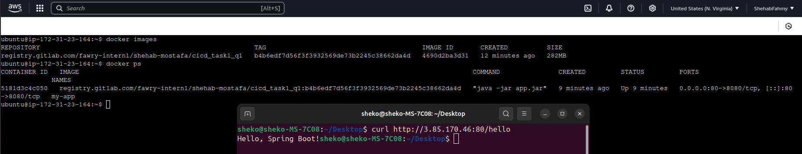
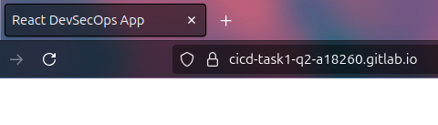
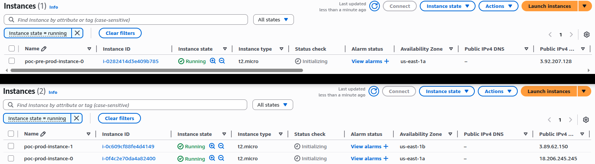
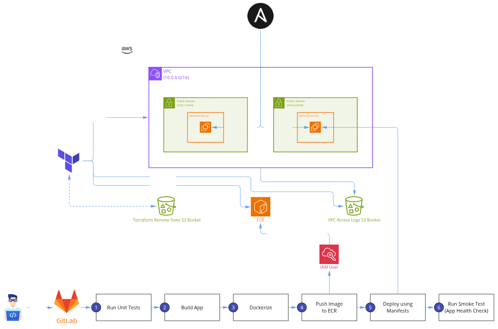

# Fawry Internship Tasks

## Tasks Overview

### Task 1: Git Operations and Branch Management
- Created and managed multiple branches (develop, alpha)
- Performed commit operations including separate file commits
- Utilized git reset for commit history navigation
- Implemented git reflog for commit recovery
- Executed branch rebasing operations

---

### Task 2: DevSecOps CI/CD Pipeline Implementation

#### Spring Boot Backend Pipeline
- Built automated CI/CD pipeline for Java Spring Boot application
- Integrated security scanning tools including SAST and dependency scanning
- Implemented container security scanning
- Configured automated testing and deployment processes

  

#### Angular/React Frontend Pipeline
- Developed CI/CD pipeline for frontend applications
- Integrated linting and unit testing automation
- Implemented security scanning for dependencies
- Configured deployment to static hosting platforms

  

---

### Task 3: AWS Infrastructure Automation with Terraform
- Implemented infrastructure as code using Terraform
- Created multi-environment architecture (pre-prod, production)
- Configured automated deployment via GitHub Actions
- Implemented OIDC authentication for secure AWS access
- Set up centralized logging with VPC Flow Logs to CloudWatch and S3

  

---

### Task 4: End-to-End Application Deployment Automation
- Containerized Spring Boot application using Docker
- Automated AWS infrastructure provisioning with Terraform
- Configured K3s Kubernetes cluster using Ansible
- Implemented GitLab CI/CD pipeline for automated testing and deployment
- Established ECR integration for container management

  

---

### Task 5: Kubernetes Deployment with Kustomize
- Containerized Flask application with MySQL backend
- Implemented environment-specific deployments using Kustomize
- Configured Kubernetes resources including StatefulSets and Services
- Managed secrets and configurations securely
- Implemented persistent storage and ingress configuration
- Set up health monitoring and resource management

---
