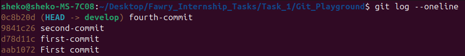

## Q1 : Git Task Instructions

---

### Branch Setup
1. Create two branches:
- `develop`
- `alpha`

```bash
git branch develop
git branch -m alpha
```

<p align="center">
  
</p>

---

#### Part 1: Work on develop Branch
1. Switch to the `develop` branch:
    ```bash
    git checkout develop
    ```
2. Create two files: `file1` and `file2`. Add content to `file1`:
    ```bash
    echo "Content for file1" > file1
    echo "Content for file2" > file2
    ```
3. Commit the files separately:
    ```bash
    git add file1
    git commit -m "first-commit"
    
    git add file2
    git commit -m "second-commit"
    ```
4. View the log in one-line format and take a screenshot:
    ```bash
    git log --oneline
    ```

<p align="center">
  
</p>

5. Use `git reset --hard` to move back to the first commit and take a screenshot:
    ```bash
    git reset --hard HEAD~1
    ```

<p align="center">
  
</p>

6. Use `git reflog` to find the previous state (second commit), reset back to it, and take screenshots from `reflog` and after resetting:
    ```bash
    git reflog
    git reset --hard <commit-hash-of-second-commit>
    ```

<p align="center">
  
</p>

---

### Part 2: Work with `alpha` Branch

1. Switch to the `alpha` branch and create a new file `file3`, then commit:
    ```bash
    git checkout alpha
    echo "Content for file3" > file3
    git add file3
    git commit -m "third-commit"
    ```
    
<p align="center">
  
</p>
    
2. Switch back to `develop`, create `file4`, and commit it:
    ```bash
    git checkout develop
    echo "Content for file4" > file4
    git add file4
    git commit -m "fourth-commit"
    ```

<p align="center">
  
</p>

3. Switch again to `alpha` and visualize the log graph:
    ```bash
    git checkout alpha
    git log --oneline --decorate --all --graph
    ```

<p align="center">
  
</p>

---

### Part 3: Rebase Operation

1. Rebase `develop` onto `alpha`:
    ```bash
    git rebase develop
    ```

<p align="center">
  
</p>

---
