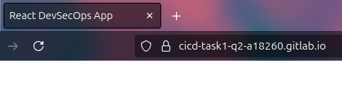

## Q2 : **CI/CD with DevSecOps for Angular or React Frontend Using GitLab**

---

This project builds a **secure and automated CI/CD pipeline** for an Angular (or React) frontend application using **GitLab CI/CD**. It emphasizes **DevSecOps principles**, incorporating frontend-specific security checks throughout the software delivery lifecycle. The pipeline automates build, test, static analysis, dependency scanning, and deployment steps, ensuring code quality and security before going live.

---

### **Objectives:**

- Automate the CI/CD process for a modern Angular or React application using GitLab.
- Integrate **frontend-focused security tools** to detect vulnerabilities and maintain code quality.
- Enforce best practices in **linting**, testing, and dependency safety throughout the pipeline.

---

### **Pipeline Stages:**

1. **Install & Build:**
    - Use **npm** or **yarn** to install dependencies and build the Angular/React application.
2. **Lint & Unit Testing:**
    - Run `ng lint` (Angular) or `eslint` (React) and unit tests using **Jasmine/Karma** or equivalent tools.
3. **SAST (Static Application Security Testing):**
    - Analyze source code with **ESLint**, **GitLab SAST**, or similar static code analysis tools.
4. **Dependency Scanning:**
    - Detect vulnerable packages in `package.json` and `package-lock.json` using **npm audit**, **Snyk**, or GitLab's built-in scanners.
5. **DAST (Optional):**
    - Perform **dynamic testing** using **OWASP ZAP** on the deployed frontend to detect runtime vulnerabilities.
6. **Deploy:**
    - Deploy the application to **GitLab Pages**, **Firebase Hosting**, **Amazon S3**, or any other static hosting service.

---

### **Tools & Stack:**

- **Framework:** Angular (or React)
- **Build Tool:** Angular CLI, npm, yarn
- **CI/CD Platform:** GitLab CI/CD
- **Security Tools:**
    - Linting & SAST: ESLint, GitLab SAST
    - Dependency Scanning: npm audit, Snyk
    - DAST (optional): OWASP ZAP
- **Testing Frameworks:** Jasmine, Karma (or Jest for React)

---

### **Outcome:**

The outcome is a **complete, secure CI/CD pipeline** tailored for modern frontend development. By integrating **DevSecOps practices**, this pipeline ensures high-quality code, early detection of vulnerabilities, and smooth, automated delivery of the application. It provides teams with confidence in both the functionality and security of their frontend code before deployment.

  

---
