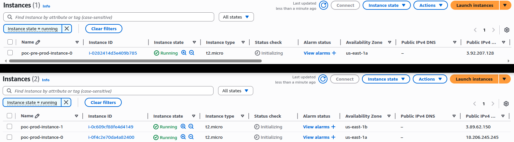

# Fawry Internship Terraform Task: AWS Landing Zone with Terraform + GitHub Actions

## 👋 Introduction

This project is a Proof of Concept (POC) for setting up a **secure, automated AWS Landing Zone** using **Terraform** and **GitHub Actions** — entirely within AWS Free Tier limits.

- Fully automated
- Uses Infrastructure as Code (IaC)
- Supports pre-production and production environments
- CI/CD pipeline deploys on GitHub push
- Implements centralized logging (VPC Flow Logs -> CloudWatch + S3)

---

## 📁 Project Structure

```bash
.
├── .github/workflows/
│   └── terraform.yml           # CI/CD for pre-prod/prod
├── envs/
│   ├── pre-prod/
│   │   ├── main.tf
│   │   ├── providers.tf
│   │   ├── terraform.tfvars
│   │   └── ...
│   └── prod/
│       ├── main.tf
│       ├── providers.tf
│       ├── terraform.tfvars
│       └── ...
├── modules/
│   ├── network/                # VPC, subnets, IGW
│   ├── compute/                # EC2
│   ├── logging/                # Flow Logs → CloudWatch + S3
│   └── ...
└── README.md
```

---

## 🌍 Landing Zone Architecture

### Pre-Prod

* 1 VPC
* 1 Public Subnet
* 1 EC2 `t2.micro` instance
* Internet Gateway
* Security Group
* GitHub Actions deploys on `pre-prod` branch

### Production

* 1 VPC
* 2 Public Subnets
* 2 EC2 `t2.micro` instances
* Internet Gateway
* Security Group
* Centralized logging:
  * VPC Flow Logs → S3 + CloudWatch Logs
* GitHub Actions deploys on `prod` branch

---

## ⚙️ Terraform Workflow

| Command             | Purpose                          |
| ------------------- | -------------------------------- |
| `terraform init`    | Initialize providers and backend |
| `terraform plan`    | Show changes before applying     |
| `terraform apply`   | Deploy infrastructure            |

---

## ☁️ Terraform State Management

Both environments share an S3 bucket with lockfile for state file management.
Prerequisites:
- Terraform: `v1.9.0+`
- AWS S3 Bucket: `poc-statefile-bucket`

<p align="center">
  
</p>

---

## 📦 Modules

### `network/`

* VPC
* Subnets (1 in pre-prod, 2 in prod)
* Internet Gateway

<p align="center">
  
</p>

### `compute/`

* EC2 Instances (1 in pre-prod, 2 in prod)
* Security Groups
* SSH Key Pair (generated locally)

<p align="center">
  
</p>

### `logging/`

* CloudWatch Log Group
* S3 Bucket for VPC Flow Logs
* IAM Role + Permissions

<p align="center">
  
</p>

---

## 🚀 GitHub Actions CI/CD

### `.github/workflows/terraform.yml`

* On **`pre-prod` branch** push:
  * Deploys to `envs/pre-prod` using its backend
* On **`prod` branch** push:
  * Deploys to `envs/prod` using its backend

---

## 🔐 GitHub → AWS Authentication (OIDC)

GitHub uses **OpenID Connect (OIDC)** to assume a secure role in AWS:

1. AWS IAM Role trusts: `token.actions.githubusercontent.com`
2. GitHub Action receives an identity token
3. AWS validates and returns temporary credentials
4. Terraform uses those credentials securely — no static AWS keys!

### Requirements
- AWS IAM OpenID Provider:
    a. Go to IAM > Identity Providers
    b. Click “Add provider”
        - Provider type: OpenID Connect
        - Provider URL: `https://token.actions.githubusercontent.com`
        - Audience: `sts.amazonaws.com`
    c. Click Add provider

- AWS IAM Policy:
```json
{
    "Version": "2012-10-17",
    "Statement": [
        {
            "Sid": "Network",
            "Effect": "Allow",
            "Action": [
                "ec2:*"
            ],
            "Resource": "*"
        },
        {
            "Sid": "S3",
            "Effect": "Allow",
            "Action": [
                "s3:*"
            ],
            "Resource": "*"
        },
        {
            "Sid": "CloudWatchLogs",
            "Effect": "Allow",
            "Action": [
                "logs:*"
            ],
            "Resource": "*"
        },
        {
            "Sid": "IAM",
            "Effect": "Allow",
            "Action": [
                "iam:GetRole",
                "iam:CreateRole",
                "iam:PutRolePolicy",
                "iam:DeleteRolePolicy",
                "iam:DeleteRole",
                "iam:PassRole",
                "iam:GetRole",
                "iam:CreateRole",
                "iam:PutRolePolicy",
                "iam:DeleteRolePolicy",
                "iam:DeleteRole",
                "iam:PassRole",
                "iam:ListRolePolicies",
                "iam:GetRolePolicy",
                "iam:ListAttachedRolePolicies",
                "iam:ListInstanceProfilesForRole"
            ],
            "Resource": "*"
        },
        {
            "Sid": "DynamoDB",
            "Effect": "Allow",
            "Action": [
                "dynamodb:*"
            ],
            "Resource": "*"
        }
    ]
}
```

- AWS IAM Role:
    a. Select Custom trust policy
    b. Click `Switch to custom trust policy`
    c. Paste this trust policy and change it with your AWS account ID, GitHub username and repository:
```json
{
	"Version": "2012-10-17",
    "Statement": [
      {
        "Effect": "Allow",
        "Principal": {
          "Federated": "arn:aws:iam::<your-account-id>:oidc-provider/token.actions.githubusercontent.com"
        },
        "Action": "sts:AssumeRoleWithWebIdentity",
        "Condition": {
          "StringEquals": {
            "token.actions.githubusercontent.com:sub": "repo:<your-github-username>/<your-repo-name>:ref:refs/heads/pre-prod",
            "token.actions.githubusercontent.com:aud": "sts.amazonaws.com"
          }
        }
      },
      {
        "Effect": "Allow",
        "Principal": {
          "Federated": "arn:aws:iam::<your-account-id>:oidc-provider/token.actions.githubusercontent.com"
        },
        "Action": "sts:AssumeRoleWithWebIdentity",
        "Condition": {
          "StringEquals": {
            "token.actions.githubusercontent.com:sub": "repo:<your-github-username>/<your-repo-name>:ref:refs/heads/prod",
            "token.actions.githubusercontent.com:aud": "sts.amazonaws.com"
          }
        }
      }
    ]
}
```

---
