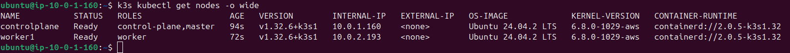
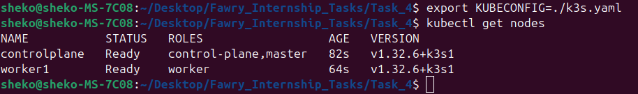
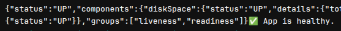
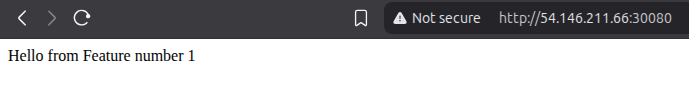

# ☁️ Cloud-Native Pipeline Automation Assignment

**Java Spring Boot — Docker — AWS — Terraform — Ansible — K3s — GitLab CI/CD**

---

## 📘 Overview

This project automates the full lifecycle of a Java Spring Boot application deployment using modern DevOps tools and practices. The app is containerized, pushed to AWS Elastic Container Registry (ECR), and deployed to a two-node lightweight Kubernetes cluster (K3s) provisioned on AWS EC2 instances. The entire workflow is triggered and managed by a GitLab CI/CD pipeline.

<p align="center">
  
</p>

---

## 🔧 Tech Stack

* **Terraform** – Infrastructure as Code (IaC) for provisioning AWS resources.
* **Ansible** – Configuration management for setting up a k3s cluster.
* **Docker** – Containerization of the Spring Boot app.
* **AWS** – EC2 for compute, ECR for container storage.
* **Kubernetes (K3s)** – Lightweight Kubernetes cluster.
* **GitLab CI/CD** – Automates testing, building, pushing, and deploying the application.

---

## 📁 Directory Structure

```
project-root/
├── terraform/
│   ├── main.tf, variables.tf, outputs.tf
│   └── Modules/
│       ├── network/
│       ├── compute/
│       └── ecr/
├── ansible/
│   ├── ansible.cfg
│   ├── inventory.yml
│   ├── playbook.yml
│   └── roles/
│       ├── common/
│       ├── k3s_control_plane/
│       └── k3s_agent/
├── .gitlab-ci.yml
├── k3s.yaml (generated manually)
├── App/ (Spring Boot app source)
│   └── Dockerfile
└── README.md
```

---

## 🚀 Pipeline Stages

GitLab CI/CD pipeline contains the following stages:

1. **Test** – Run Java unit tests.
2. **Build** – Package the Spring Boot app into a JAR.
3. **Dockerize** – Build and tag the Docker image.
4. **Push** – Push image to AWS ECR.
5. **Deploy** – Deploy to k3s using `kubectl apply`.
6. **Smoke Test** – Run a health check at `http://<public-node-ip>:30080/actuator/health`.

---

## 🛠️ How to Run

### 🔐 GitLab + AWS ECR Authentication (Static Credentials)

> GitLab Free plan does **not** support OIDC for AWS authentication. Use IAM User credentials:

1. **Create IAM User**:
   Name: `gitlab-ci-user`
   Policy: `AmazonEC2ContainerRegistryFullAccess`

2. **Generate AWS Access Keys**

3. **Store Secrets in GitLab** → `Settings > CI/CD > Variables`:

   * `AWS_ACCOUNT_ID`
   * `AWS_ACCESS_KEY_ID`
   * `AWS_SECRET_ACCESS_KEY`

   ✅ Mark as **Protected** and **Masked**

---

### 🧱 Step 1: Provision Infrastructure (Terraform)

```bash
cd Terraform/
terraform init
terraform apply
```

* This will:

  * Provision a VPC, public subnets, internet gateway, route table.
  * Create 2 EC2 instances (1 control plane, 1 worker) with necessary ports opened.
  * Generate an SSH key pair for EC2 access.
  * Set up AWS ECR.
  * Tags EC2 instances using Role=controlplane and Role=worker.

---

### ⚙️ Step 2: Configure K3s Cluster (Ansible)

```bash
cd Ansible/
ansible-playbook playbook.yml
```

* Installs K3s server and agent.
* Joins the worker node to the cluster through a token shared securely using Ansible Vault.
* Labels each node with its Role (controlplane and worker).

✅ Final check: After playbook finishes:

<p align="center">
  
</p>

---

### 🔗 Step 3: Retrieve and Prepare `k3s.yaml` for GitLab

1. Copy kubeconfig from control plane:

```bash
scp -i "Terraform/poc-prod-keypair.pem" ubuntu@<control-plane-public-ip>:/etc/rancher/k3s/k3s.yaml ./k3s.yaml
```

2. Edit `k3s.yaml`:
   Replace:

```yaml
server: https://0.0.0.0:6443
```

With:

```yaml
server: https://<control-plane-public-ip>:6443
```

3. Test locally (optional):

```bash
export KUBECONFIG=./k3s.yaml
kubectl get nodes
```

<p align="center">
  
</p>

4. Copy full contents of `k3s.yaml` and store in GitLab project variable:

   * Key: `KUBECONFIG_CONTENT`

---

### 📦 Step 4: Configure Node IP in Pipeline

Edit `.gitlab-ci.yml`:

```yaml
variables:
  WORKER_NODE_PUBLIC_IP: "<worker-node-public-ip>"
```

---

### 🧪 Step 5: Run GitLab Pipeline

Push changes to GitLab to trigger the pipeline:

```bash
git add .
git commit -m "Setup full automation pipeline"
git push origin main
```

If everything is configured properly, all pipeline stages should succeed, and your app will be accessible via:

```
http://<worker-node-ip>:30080
```

---

## Final Results

<p align="center">
  <strong>Smoke Test</strong>
  <br>
  
</p>

<p align="center">
  <strong>Accessing App</strong>
  <br>
  
</p>

---
